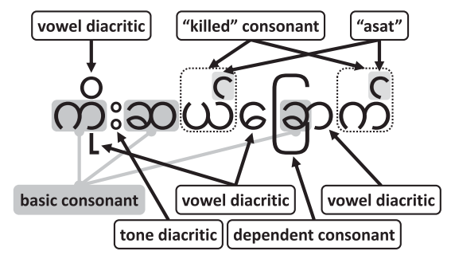
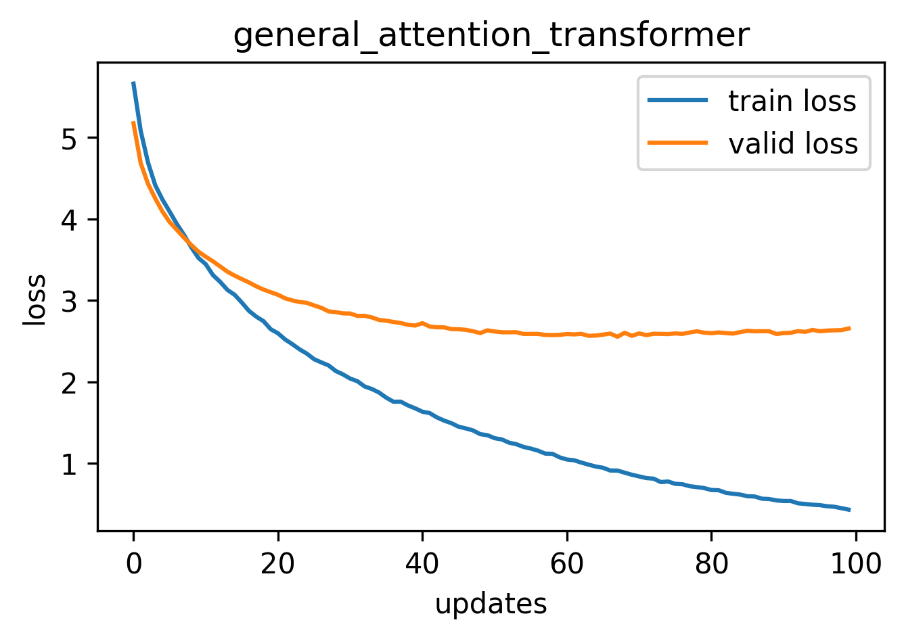
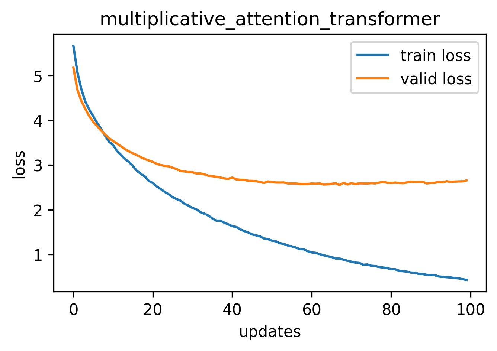
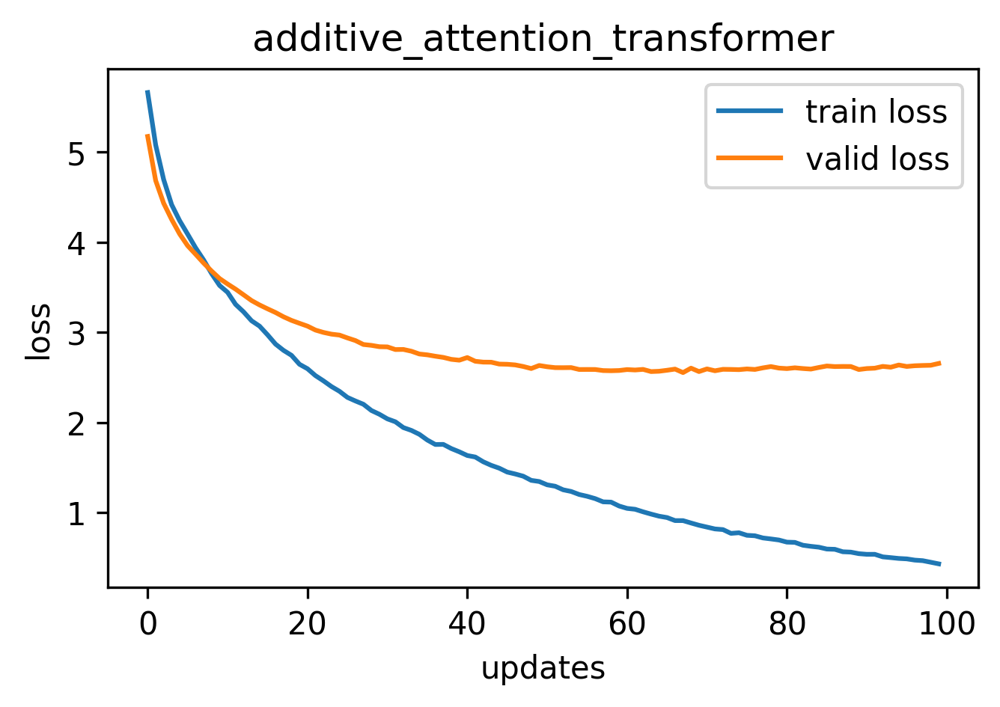
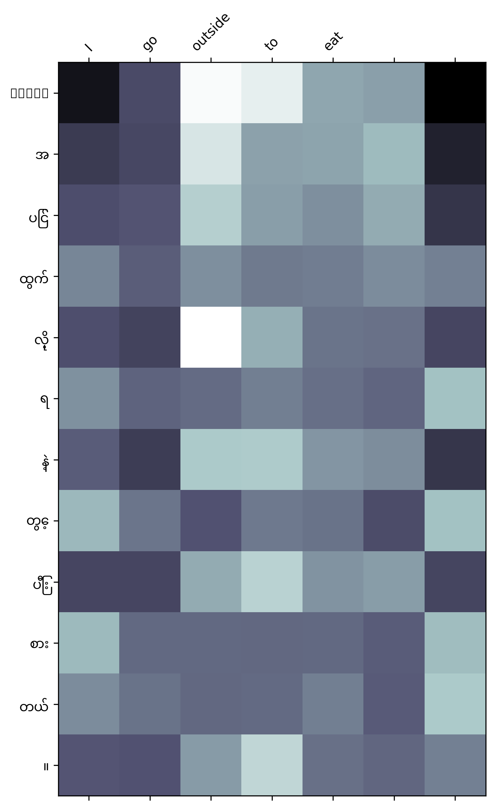
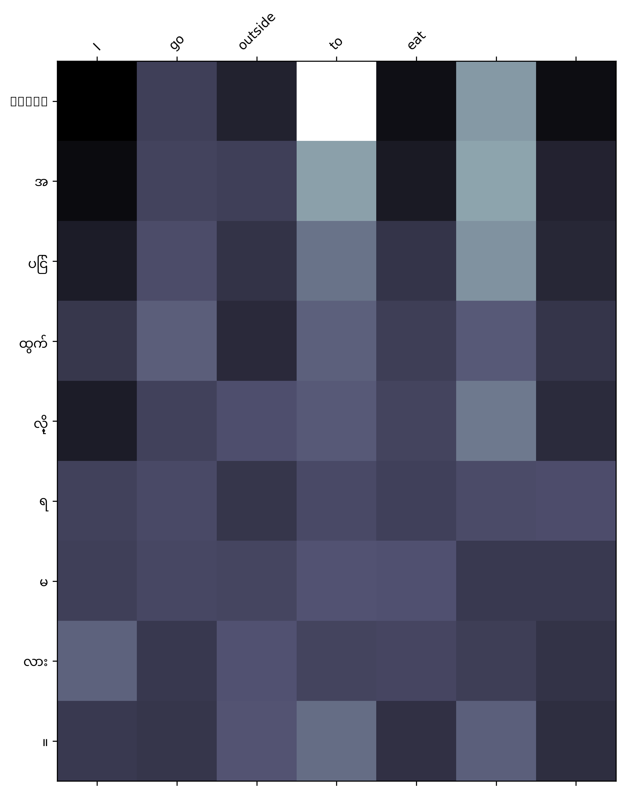
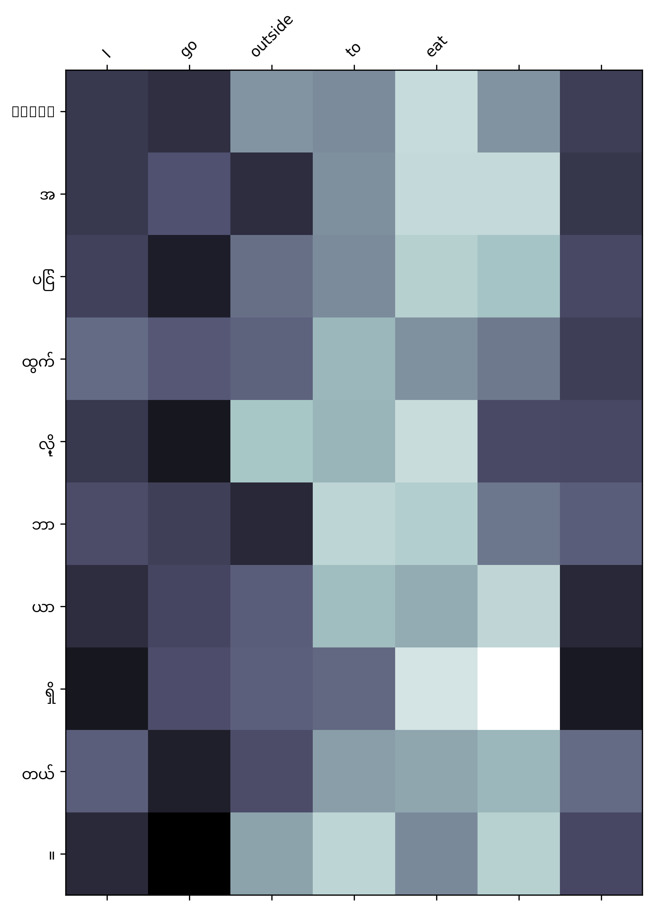

# NLP-A3
NLP assignment from AIT

**Kaung Htet Cho (st124092)**

## Table of Contents
1. [Task1](#Task1)
2. [Task2](#Task2)
3. [Task3](#Task3)

## Task1
#### Dataset Acquisition

Collect Eng / Myanmar parallel copurs from **TUFS Asian Language Parallel Corpus (TALPCo)** (https://github.com/matbahasa/TALPCo). Combine these two .txt files and make english-mynamar pairs. And then uploaded to hugging face repository in order to make load_datasets easier. (https://huggingface.co/datasets/KaungHtetCho/MT-myanmar-english)

*Parameters*  ==>  (train = 1093 rows | test  = 137 rows | valid = 137 rows)

#### Preprocessing

- Burmese tokenizer | Credit to Kaung Htet San for pyidaungsu Burmese tokenizer (https://pypi.org/project/pyidaungsu/?fbclid=IwAR2zk1sDeEEm-y3nPzzikzOux4hN7D-igRWpjZENL-01UBnbjHsylKP1nQU)

- English tokenizer | get_tokenizer function from spacy

#### burmese word segmentaion process

- In Burmese writing, words are not always separated by spaces. Sometimes, spaces are used to make phrases clearer, but this is not a strict rule. In short sentences, spaces are rarely used. There are no definite rules on when to use spaces in Burmese, so sometimes words have spaces between them and sometimes they don't.

- Every single consonant letter in Burmese can create a syllable with an automatic vowel sound, like /a/ or a schwa. Other vowel sounds can be made by adding different marks. There are also marks for tones, marks for combining consonants at the start of syllables, and a special mark called "asat" that removes the automatic vowel sound for syllables ending in nasal or glottal sounds.

[Link to research](https://dl.acm.org/doi/pdf/10.1145/2846095)

- Burmese word segmentation involves adding spaces in text without changing or rewriting anything else. As stated earlier, since syllables in Burmese are indivisible units, the process starts by separating these syllables with spaces. The next step is to figure out how these syllables come together to form words, which involves removing some of the spaces that were added between syllables. This is the basic approach for machines to segment Burmese words.

- Passed en_my corpust(SRC_LANGUAGE(ENGLISH) to get_tokenizer function and TRG_LANGUAGE(BURMESE) to pds.tokenize function). 

## Task2
#### Experiment with attention mechanisms

| Attentions          | Training Loss | Training PPL | Validation Loss | Validation PPL | 
|----------------|-------------|---------------|---------------|--------------------|
| General Attention       |    0.396      |      1.485  |       2.547        |            12.766        |   
| Multiplicative Attention |         0.396   |     1.487      |         2.608   |          13.578         |    
| Additive Attention          |   0.430       |  1.537   |        2.553 |         12.840      |    

## Task3
#### 1. Performance comparisons

- epochs = 100
- device = Nvidia GeForce RTX 3060
- batch_size = 64
- num_heads = 8
- num_layers = 3
- optimizer = Adam
- learning_rate = 0.0001

| Attentions          | Training time | Test PPL |
|----------------|-------------|---------------|
| General Attention       |    50s        |   18.541     |    
| Multiplicative Attention |          54s   |     13.695       |  
| Additive Attention          |       1m 37s    |    13.463      |  

#### 2. Performance plots

<table>
  <tr>
    <td align="center">
      
       
      <em>Fig. 1: Seq2seq transformer with general attention</em>
    </td>
    <td align="center">
      
       
      <em>Fig. 2: Seq2seq transformer with multiplicative attention</em>
    </td>
    <td align="center">
      
       
      <em>Fig. 3: Seq2seq transformer with additive attention</em>
    </td>
  </tr>
</table>

#### 3. Attention maps

<table>
  <tr>
    <td align="center">
      
       
      <em>Fig. 1: General attention map</em>
    </td>
    <td align="center">
      
       
      <em>Fig. 2: Multiplicative attention map</em>
    </td>
    <td align="center">
      
       
      <em>Fig. 3: Additive attention map</em>
    </td>
  </tr>
</table>

#### 4. Analysis report

Implemented Human Evaluation

## Task3
### Web app documentation

The Website can be accessed on http://localhost:8000. User can type (English sentence) to input box and then the model translate into (Burmese sentence). My model is trained on transformer using general attention, multiplicative attention, additive attention mechanism. The main purpose is to see the differences between those mechanisms (The translational accuracy). According to the loss and perplexity scores, you can see the addictive model get the most similar accuracy with the true burmese meaning